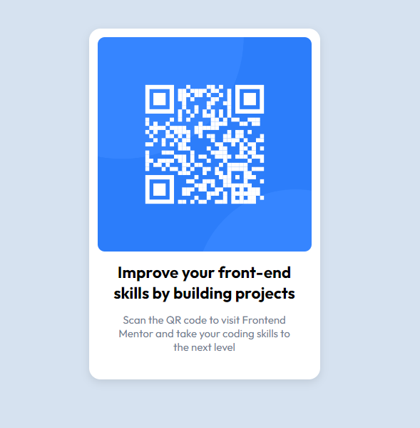

# Frontend Mentor - QR code component solution

This is a solution to the [QR code component challenge on Frontend Mentor](https://www.frontendmentor.io/challenges/qr-code-component-iux_sIO_H). Frontend Mentor challenges help you improve your coding skills by building realistic projects. 

## Table of contents

- [Overview](#overview)
  - [Screenshot](#screenshot)
  - [Links](#links)
- [My process](#my-process)
  - [Built with](#built-with)
  - [What I learned](#what-i-learned)
- [Author](#author)

## Overview

My first challenge on the site, pretty simple out of the box.

### Screenshot

### Links

Not currently hosted

## My process

I focused on visualising the layout of the element without any content, then building onto the layout with colours, shadows and fonts to finish the card.

### Built with

- Semantic HTML5 markup
- CSS custom properties

### What I learned

Not much, this was just a recap for me.

## Author

Me ;)